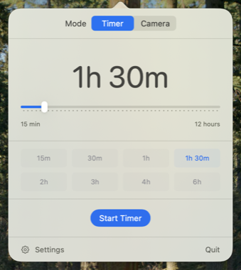
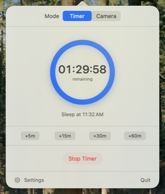
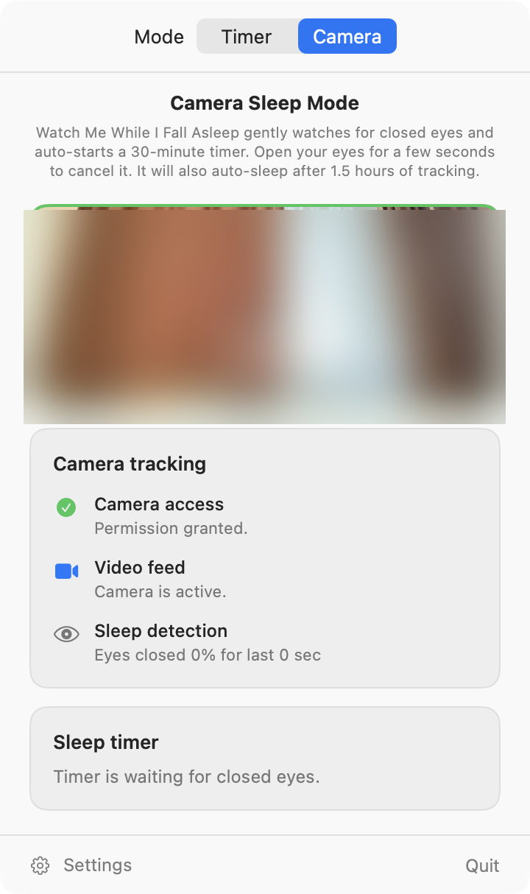
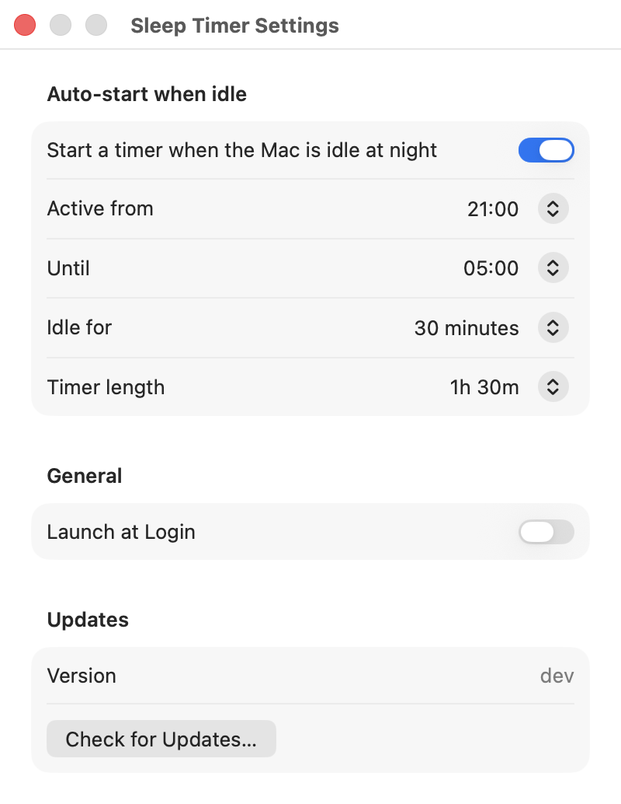

# Sleep Timer for macOS

[](https://github.com/wiltodelta/sleep-timer-app/actions/workflows/build.yml)

A menu bar application for macOS that allows you to set a sleep timer to automatically put your Mac to sleep. Features both manual timer mode and intelligent camera-based sleep detection.

## Screenshots

<p align="center">
  
  
  
  
</p>

## Features

### ⏱️ Advanced Timer Controls
- **Menu Bar Countdown**: View the remaining time directly in your menu bar next to the icon.
- **Flexible Duration**: Set timers anywhere from 15 minutes to 12 hours.
- **Quick Presets**: One-click access to common durations (15m, 30m, 1h, 1.5h, 2h, 3h, 4h, 6h).
- **Easy Extension**: Add +5, +15, +30, or +60 minutes to an active timer instantly.
- **Auto-Start When Idle**: Optionally arm a timer on its own once the Mac sits idle for a set number of minutes inside a nightly window (so you never forget to start it).
- **Quick Menu**: Right-click the menu bar icon to start a common timer, stop the current one, or open settings without opening the popover.
- **Visual Feedback**: Circular progress ring and dynamic menu bar icons (moon/filled moon).

### 📷 Intelligent Sleep Detection
- **Auto-Sleep**: Automatically starts a 30-minute timer when it detects your eyes are closed for ~15 seconds.
- **Live Preview**: See the camera feed in the popover, with a border that turns green when your face is detected.
- **Activity Check**: After 1.5 hours in camera mode, prompts you to confirm if you're still awake. If no response within 30 seconds, automatically puts the Mac to sleep.
- **Privacy First**: All processing is done on-device using Apple's Vision Framework. No video data is stored or transmitted.
- **Smart Wake**: Automatically cancels the pending timer if you open your eyes.
- **Energy Efficient**: Optimized "Eye Aspect Ratio" (EAR) algorithm for minimal battery impact.
- **Auto Mode Switch**: Automatically returns to manual mode before putting the computer to sleep.

### 🎨 System Integration & Design
- **Adaptive App Icon**: The application icon automatically changes between Light and Dark versions to match your macOS theme.
- **Native Architecture**: Uses `pmset` command for reliable and safe system sleep.
- **Native UI**: Restrained, system-style design that fits in on macOS Sonoma, Sequoia, and Tahoe.
- **Launch at Login**: Option to start the app automatically in the background.

## Requirements

- macOS 13.0 (Ventura) or later (Ready for macOS 26 Tahoe)
- Apple Silicon (M1/M2/M3/M4) or Intel Mac (runs via Rosetta 2 on older macOS)
- Xcode 15.0 or later (for building from source)

## Installation

### Option 1: Download Pre-built App (Recommended)

1. Go to [Actions](https://github.com/wiltodelta/sleep-timer-app/actions) tab
2. Click on the latest successful build
3. Download `Sleep-Timer-macOS` artifact
4. Unzip the downloaded file
5. **Important**: Remove the quarantine attribute:
   ```bash
   xattr -cr "Sleep Timer.app"
   ```
6. Move `Sleep Timer.app` to Applications folder

> **Note**: The app is not notarized by Apple, so you need to remove the quarantine attribute or right-click and select "Open" the first time.
>
> **Security**: If you have concerns about running a pre-built app, you can always review the source code and build it yourself (see Option 2 below).

### Option 2: Building from Source

1. Clone the repository:
```bash
git clone https://github.com/wiltodelta/sleep-timer-app.git
cd sleep-timer-app
```

2. Create app bundle:
```bash
./create-app.sh
```

3. Open the app:
```bash
open "Sleep Timer.app"
```

Or move to Applications:
```bash
mv "Sleep Timer.app" /Applications/
```

## Usage

### Manual Timer Mode
1. Launch the application - a moon icon will appear in your menu bar
2. Click the moon icon to open the timer interface
3. Select "Timer" mode at the top
4. Set your desired sleep time:
   - Use the slider for custom times
   - Click a preset button for quick selection
5. Click "Start Timer" to begin
6. The menu bar icon changes to indicate an active timer (filled moon)
7. Click the menu bar icon again to:
   - View remaining time and progress
   - Add more time if needed
   - Cancel the timer

> **Quick actions**: Right-click the menu bar icon for a menu that starts a common timer (15m/30m/1h/1.5h/2h), stops the current one, or opens settings without opening the popover.

### Auto-Start When Idle
1. Open Settings (the gear in the menu bar popover, or Cmd+,) and enable "Start a timer when the Mac is idle at night"
2. Pick the window start and end hours, how many idle minutes should pass, and the timer length
3. When the Mac sits idle past that threshold inside the window, a regular timer arms automatically
4. It stays out of the way while a timer is already running or while Camera Mode is active

### Camera Mode
1. Click the moon icon in your menu bar
2. Select "Camera" mode at the top
3. Grant camera permission when prompted
4. The app shows a live preview and starts tracking your eyes; the preview border turns green once your face is detected
5. When your eyes are closed for ~15 seconds, a 30-minute timer starts automatically
6. Open your eyes for a few seconds to cancel the timer
7. Every 1.5 hours, you'll be asked if you're still awake
   - Respond within 30 seconds to continue
   - No response will put the Mac to sleep automatically

## Permissions

The app requires the following permissions:

**Required:**
- None. Sleep is triggered via the `pmset sleepnow` command, which needs no special permission.

**Optional (for Camera Mode):**
- Camera access - to detect when your eyes are closed
- All camera processing happens on-device; no data is sent anywhere

## Technical Details

- Built with Swift and SwiftUI
- Uses `pmset sleepnow` command for reliable system sleep
- Runs as menu bar only application (no dock icon)
- Launch at Login support via `SMAppService`
- Camera mode uses Vision Framework for face and eye detection
- Eye Aspect Ratio (EAR) algorithm for sleep detection
- Idle auto-start reads system idle time from IOKit (`IOHIDSystem` `HIDIdleTime`); no extra permission required
- Optimized performance with cached frame counting (O(1) complexity)
- Minimal resource usage and energy efficient
- Automatic mode switching before sleep to ensure clean state

## Releases

### How to Create a New Release

The app version is automatically derived from git tags. To release a new version:

1. **Commit and push your changes:**
```bash
git add .
git commit -m "Add new features"
git push origin main
```

2. **Create and push a git tag:**
```bash
git tag -a v1.3.0 -m "Release v1.3.0: Activity check in camera mode"
git push origin v1.3.0
```

3. **GitHub Actions will automatically:**
   - Extract version from the tag (e.g., `v1.2.0` → `1.2.0`)
   - Build the app with the correct version
   - Create a GitHub Release
   - Attach the app as a downloadable ZIP file

**Version format:** Use semantic versioning `MAJOR.MINOR.PATCH`
- MAJOR: Breaking changes (e.g., `1.x.x` → `2.0.0`)
- MINOR: New features (e.g., `1.1.x` → `1.2.0`)
- PATCH: Bug fixes (e.g., `1.1.2` → `1.1.3`)

**Note:** Local builds use version `dev` and are not intended for distribution

## Contributing

Contributions are welcome! Please feel free to submit a Pull Request.

## Development

### Running Tests

The project includes comprehensive unit tests for core functionality:

```bash
# Run all tests
swift test

# Run tests with verbose output
swift test --verbose
```

Test coverage includes:
- **TimerManager**: Timer lifecycle, add time, notifications, sleep trigger seam
- **SleepDetectionManager**: Camera mode, state management, initialization
- **AutoActivationManager**: Nightly window logic, idle-threshold activation decisions
- **EyeAspectRatio**: EAR math across 6/8/12-point contours, geometric fallback, and degenerate input

### Building from Source

```bash
# Quick run for development
./run.sh

# Build release version
swift build -c release

# Create app bundle
./create-app.sh
```

## License

MIT License - feel free to use this project for personal or commercial purposes.

## Troubleshooting

**"Sleep Timer is damaged and can't be opened" error:**
- This is macOS Gatekeeper blocking unsigned apps downloaded from the internet
- To fix this, first navigate to Applications folder in Terminal:
  ```bash
  cd /Applications
  ```
- Then run this command to remove the quarantine attribute:
  ```bash
  xattr -cr "Sleep Timer.app"
  ```
- Alternatively, right-click the app in Finder, select "Open", and confirm in the dialog
- **Why this happens**: The app is not notarized by Apple, so macOS marks it as potentially unsafe

**Timer doesn't put Mac to sleep:**
- Sleep is triggered via the `pmset sleepnow` command, which needs no special permission
- Make sure no other process is preventing sleep (for example `caffeinate`, or an app holding a power-management assertion); check with `pmset -g assertions`

**Camera mode not working:**
- Check System Settings > Privacy & Security > Camera
- Ensure Sleep Timer has camera access enabled
- Make sure your face is visible and well-lit
- The camera green indicator should be visible when camera mode is active

**"Looking for your face..." message:**
- Ensure your face is centered and clearly visible to the camera
- Check lighting conditions - avoid backlighting
- Clean your camera lens if needed
- Make sure no other app is using the camera

**App doesn't appear in menu bar:**
- Check that you're running macOS 13.0 or later
- Try quitting and restarting the application

## Credits

Created with ❤️ for Mac users who want better control over their sleep schedules.
