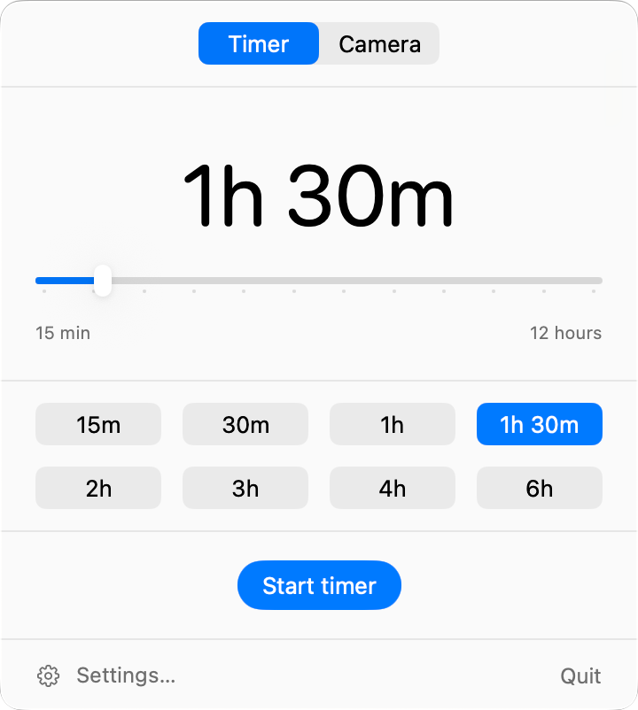
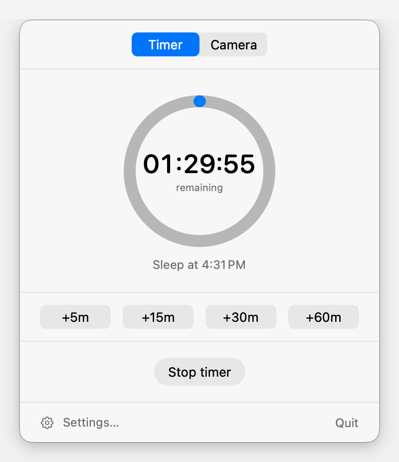
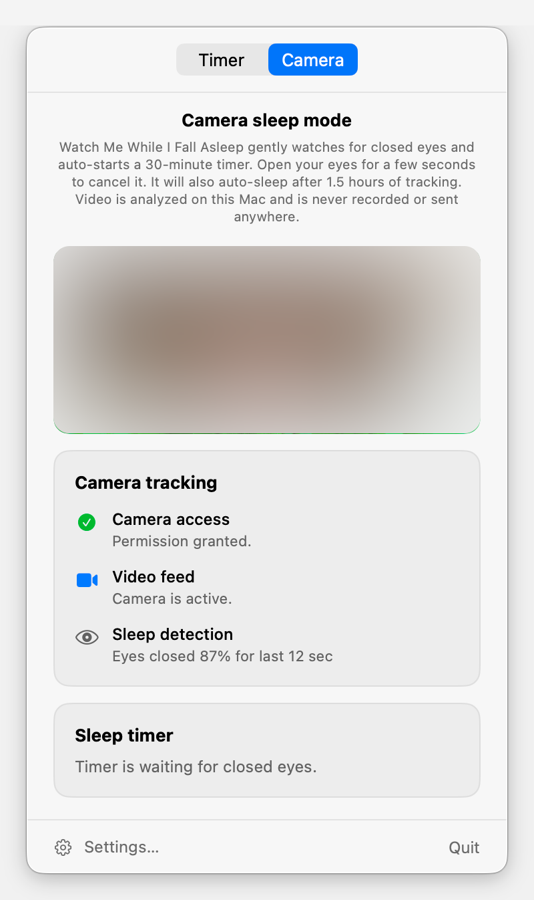
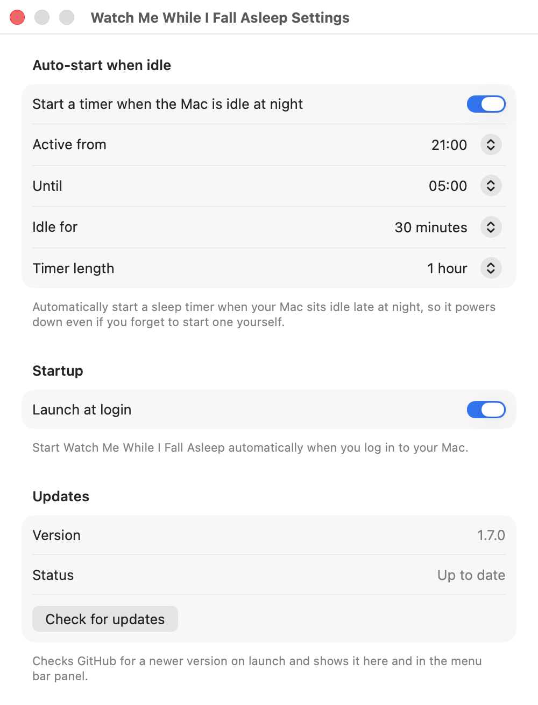

# Watch Me While I Fall Asleep

[](https://github.com/wiltodelta/watch-me-sleep/actions/workflows/build.yml)

A macOS menu bar app that puts your Mac to sleep on a timer. Set a countdown by
hand, or switch on Camera mode and it starts the timer for you when it sees your
eyes stay closed. Menu bar only, no Dock icon.

<p align="center">
  
  
  
  
</p>

## Features

Timer:

- Remaining time shown in the menu bar next to the icon.
- Any duration from 15 minutes to 12 hours, plus one-click presets (15m, 30m,
  1h, 1.5h, 2h, 3h, 4h, 6h).
- Extend a running timer by +5, +15, +30, or +60 minutes.
- Right-click the icon for a quick menu: start a common timer, stop the current
  one, or open Settings.
- Circular progress ring, and a moon icon that fills in while a timer runs.

Camera mode:

- Starts a 30-minute timer on its own when your eyes stay closed for about 15
  seconds, and cancels it if you open them.
- Live preview with a border that turns green once your face is detected.
- After 1.5 hours it asks if you are still awake, and sleeps the Mac if there is
  no response within 30 seconds.
- All processing is on-device with Apple's Vision framework. No video is stored
  or sent anywhere.

Auto-start and system:

- Optionally arm a timer on its own once the Mac sits idle for a set number of
  minutes inside a nightly window, so you never forget to start one.
- Launch at login.
- Adaptive app icon (light/dark), restrained system-style UI.

## Requirements

- macOS 14 (Sonoma) or later. The three latest macOS releases are supported;
  on macOS 26 (Tahoe) and later the UI uses Liquid Glass.
- A Mac with Apple silicon. Intel Macs are not supported.
- For building from source: Xcode 26 or later.

## Install

### From a release

1. Download the latest `Watch-Me-While-I-Fall-Asleep-vX.Y.Z-macOS.zip` from the
   [Releases](https://github.com/wiltodelta/watch-me-sleep/releases) page.
2. Unzip it and move **Watch Me While I Fall Asleep.app** to `/Applications`.
3. Launch it. Releases from 2.1.0 on are signed with a Developer ID and
   notarized by Apple, so macOS opens them without a warning. A moon icon appears in the menu bar (there is no Dock icon).

The app checks GitHub Releases on launch and tells you when a newer version is
out, so updating later is just steps 1 to 3 again.

### From source

```bash
git clone https://github.com/wiltodelta/watch-me-sleep.git
cd watch-me-sleep
./create-app.sh
mv "Watch Me While I Fall Asleep.app" /Applications/
```

## First run

- Manual timer mode needs no permissions at all.
- Camera mode asks for **Camera** access the first time you open it (System
  Settings > Privacy & Security > Camera). It is optional; the timer works
  without it, and all camera processing stays on-device.

## Usage

### Manual timer

1. Click the moon icon and select **Timer**.
2. Set a duration with the slider or a preset, then click **Start Timer**.
3. The icon fills in while the timer runs. Click it again to see the remaining
   time, add time, or stop.

Right-click the icon for a quick menu that starts a common timer
(15m/30m/1h/1.5h/2h), stops the current one, or opens Settings.

### Camera mode

1. Click the moon icon, select **Camera**, and grant camera access.
2. The preview border turns green once your face is detected.
3. When your eyes stay closed for about 15 seconds, a 30-minute timer starts.
   Open your eyes for a few seconds to cancel it.
4. Every 1.5 hours it asks if you are still awake; no response within 30 seconds
   sleeps the Mac.

### Auto-start when idle

Enable it in Settings, then pick the nightly window (start and end hour), how
many idle minutes should pass, and the timer length. When the Mac sits idle past
that threshold inside the window, a timer arms on its own. It stays out of the
way while a timer is already running or Camera mode is active.

## Settings

Open Settings from **Settings…** in the panel, from the right-click menu, or by
opening the app again from Finder or Spotlight (useful if its menu bar icon is
hidden).

- **Auto-start when idle**: the nightly window, idle threshold, and timer length.
- **Startup**: launch at login.
- **Updates**: current version, automatic daily checks on or off, and a **Check
  for Updates…** button.

## Updates

The app uses [Sparkle](https://sparkle-project.org) (MIT licensed; its notice
ships in the app bundle) to check once a day for a new release. It never takes
focus from what you are doing: when an update is found, an **Install X.Y.Z…**
button appears in the panel footer, and the update window opens only when you
choose it or check by hand from Settings > Updates. Updates are signed with an
EdDSA key as well as the Developer ID, and install in place with a relaunch.
Automatic checks can be turned off in Settings.

## Troubleshooting

- **"Watch Me While I Fall Asleep is damaged and can't be opened":** releases
  before 2.1.0 were not notarized. Update to the latest release, or clear the
  quarantine flag with `xattr -cr "/Applications/Watch Me While I Fall Asleep.app"`.
- **The timer doesn't sleep the Mac:** something may be holding a power
  assertion (for example `caffeinate` or a media app). Check with
  `pmset -g assertions`.
- **Camera mode isn't working:** enable the app under System Settings > Privacy
  & Security > Camera, and make sure your face is visible and well lit. 2.1.0 is
  the first release signed with a Developer ID, a different signature from
  earlier builds, so macOS asks for camera access once more after the update.
- **No icon in the menu bar:** confirm you are on macOS 14 or later; on macOS 26
  also check System Settings > Menu Bar > Allow in the Menu Bar. Opening the app
  again shows its settings window either way.

## Building and releasing

- `./create-app.sh` assembles the signed `.app` bundle: with the maintainer's
  Developer ID identity in the keychain it signs with it (hardened runtime and
  the camera entitlement in `WatchMeSleep.entitlements`), otherwise
  ad hoc, and then camera access re-prompts after every rebuild.
- `RELEASE=1 ./create-app.sh && ./notarize.sh` adds a secure timestamp,
  notarizes, staples, and writes the release zip.
- `bash maintain.sh` runs SwiftLint, the tests, and a release build.
- `./capture-screenshots.sh` rebuilds the app and regenerates the screenshots
  above through Accessibility, blurring the camera feed. It needs Accessibility
  and Screen Recording access for the terminal and turns the camera on briefly.

Releases are automated: the app version comes from the git tag, and pushing a
`vX.Y.Z` tag makes GitHub Actions build the app, sign it with the Developer ID,
notarize it, and publish a Release with the zip and the Sparkle `appcast.xml`
attached; the tag annotation's body becomes both the release notes and the text
of the update window. The tag build reads the repository secrets
`DEVELOPER_ID_P12_BASE64`, `DEVELOPER_ID_P12_PASSWORD`, `NOTARY_KEY_P8_BASE64`,
`NOTARY_KEY_ID`, `NOTARY_ISSUER_ID`, and `SPARKLE_PRIVATE_KEY`; GitHub never
passes them to pull requests from forks, and branch builds stay ad hoc. Their
source is the 1Password item "Apple Developer ID: Victor Kuznetsov
(K2GT9Q4S6U)" (Private vault), which also holds the restore commands and the
Sparkle EdDSA key (one key for every app of the team; `SUPublicEDKey` in
`create-app.sh` is its public half); the certificate expires on 2031-09-17. The bundle identifier
`com.wiltodelta.watchmesleep` is registered as an explicit App ID for that team
in the Apple Developer portal; keep it, since the Camera grant, the settings and
the login item are keyed to it.

```bash
git tag -a vX.Y.Z -F notes.md   # first line the title, blank line, then the notes
git push origin vX.Y.Z
```

Local builds report version `dev` and are not meant for distribution.

## License

Licensed under the Apache License, Version 2.0. See [LICENSE](LICENSE) for the
full text.
