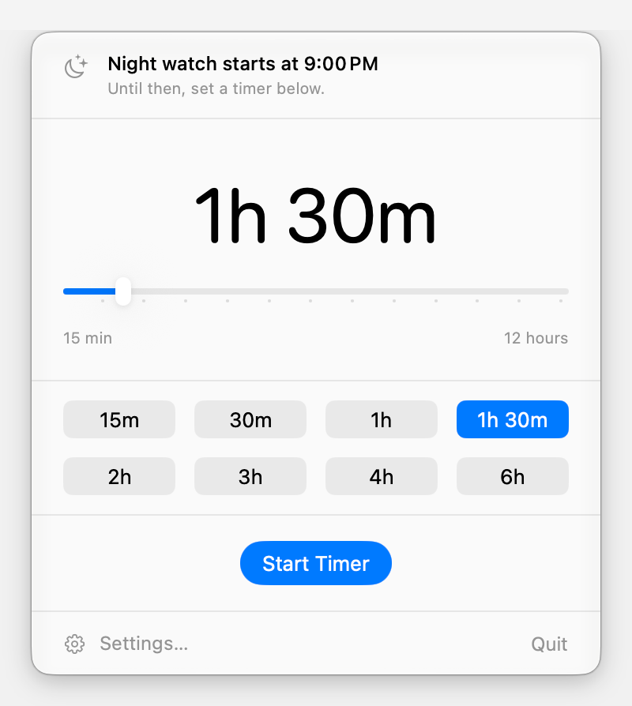
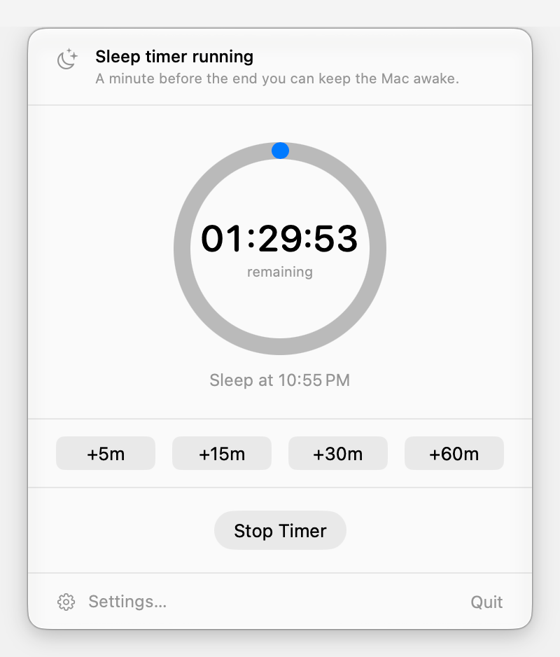
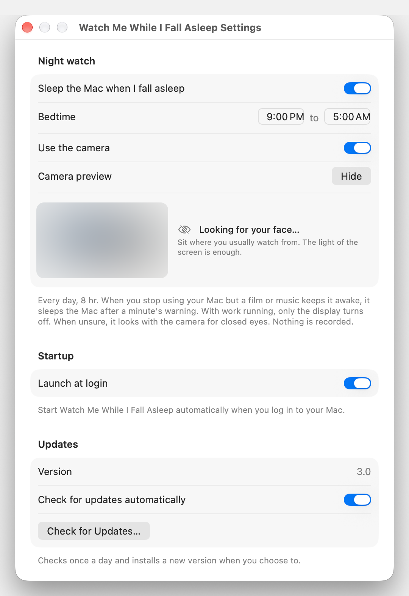

# Watch Me While I Fall Asleep

[](https://github.com/wiltodelta/watch-me-sleep/actions/workflows/build.yml)

A macOS menu bar app that puts your Mac to sleep once you fall asleep. At
bedtime it notices when a film or music keeps the Mac awake but nobody is
using it any more, takes a short look with the camera when unsure, and sleeps
the Mac with a minute's warning. A timer covers the rest of the day. Menu bar
only, no Dock icon.

<p align="center">
  
  
  
</p>

## Features

Night watch (on by default, during bedtime hours you choose):

- Watches what keeps the Mac awake, not just how long it sat idle: macOS already
  sleeps an idle Mac, so the night watch steps in when a video, music, or a
  podcast keeps it up after you stopped using it.
- When something plays and nobody touches the Mac, the camera takes a short
  look: closed eyes, or nobody there (or too dark to see), start a 15-minute
  timer; open eyes leave a film you are still watching alone, and it looks
  again in 10 minutes. Two detectors must agree that eyes are closed, so a
  smile or glasses are not taken for sleep
  ([measurement](docs/eye-detection.md)).
- Without the camera it still works: nothing playing and no input for 20
  minutes starts the timer; something playing for 90 minutes without input
  asks whether you are still watching.
- Never runs the camera outside bedtime, never asks for camera access at night,
  and analyzes frames on this Mac with Apple's Vision framework; nothing is
  recorded or sent anywhere.
- Work keeps going: when `caffeinate`, a download, a build, or an agent holds
  the Mac awake, only the display turns off, and the Mac sleeps by itself once
  the work lets go.
- The panel says what it is doing: "Something is playing. No input for 12 min.
  The camera looks at 23:40."

Timer:

- Remaining time shown in the menu bar next to the icon.
- Any duration from 15 minutes to 12 hours, plus one-click presets (15m, 30m,
  1h, 1h 30m, 2h, 3h, 4h, 6h).
- Extend a running timer by +5m, +15m, +30m or +1h.
- Escape closes the panel; a running timer keeps going.
- Right-click the icon for a quick menu: start a common timer, stop the current
  one, or open Settings.
- Circular progress ring, and a moon icon that fills in while a timer runs.

Every timer, set by hand or by the night watch:

- A gentle last minute: a small panel in the corner counts down with **+15m**
  and **Sleep Now**, and the volume fades out. When work holds the Mac awake,
  the panel and the countdown say the display turns off, not that it sleeps. It shows over full-screen video
  and does not take the keyboard from the player. The volume comes back when
  the Mac or its display wakes.
- Never sleeps a Mac in use: touch the mouse or keyboard during that last
  minute (or, for the night watch's timer, look at the camera) and the timer
  moves on by 15 minutes instead.

System:

- Launch at login.
- In-place updates: checks once a day and installs a new version when you
  choose to (Sparkle).
- Adaptive app icon (light/dark), restrained system-style UI.

## Requirements

- macOS 14 (Sonoma) or later. The three latest macOS releases are supported;
  on macOS 26 (Tahoe) and later the UI uses Liquid Glass.
- A Mac with Apple silicon. Intel Macs are not supported.
- For building from source: Xcode 26 or later.

## Install

### From a release

1. Download the latest `Watch-Me-While-I-Fall-Asleep-vX.Y.Z-macOS.zip` from the
   [Releases](https://github.com/wiltodelta/watch-me-sleep/releases) page.
2. Unzip it and move **Watch Me While I Fall Asleep.app** to `/Applications`.
3. Launch it. Releases from 2.1.0 on are signed with a Developer ID and
   notarized by Apple, so macOS opens them without a warning. A moon icon
   appears in the menu bar (there is no Dock icon).

From 2.2.0 on the app updates itself (see [Updates](#updates)).

### From source

```bash
git clone https://github.com/wiltodelta/watch-me-sleep.git
cd watch-me-sleep
./create-app.sh
mv "Watch Me While I Fall Asleep.app" /Applications/
```

## First run

- The night watch and the timer need no permissions at all.
- The camera is optional. Turn on **Use the camera** in Settings and the app
  asks for **Camera** access then (System Settings > Privacy & Security >
  Camera); **Camera preview > Show** shows what it sees.

## Usage

### Night watch

It is on from 9 PM to 8 AM by default. Set bedtime in Settings to any times,
to the minute (10:30 PM to 6:45 AM, or a daytime sleep after a night shift).
During those hours, once you stop using the Mac:

- Nothing playing, nobody at the keyboard: after 20 minutes a 15-minute timer
  starts. The camera stays off: with nothing playing, nobody is watching.
- Something playing: after 10 minutes the camera looks. Closed eyes or nobody
  there start a 15-minute timer; open eyes mean you are watching, and it looks
  again in 10 minutes. If the picture stays unclear (dim light, a face turned
  away), or there is no camera, it asks after 90 minutes whether you are still
  watching.
- After three hours without input it asks anyway: some people sleep with their
  eyes partly open.
- It acts once per stretch of not using the Mac, and starts over when you are
  back.

### Timer

1. Click the moon icon.
2. Set a duration with the slider or a preset, then click **Start Timer**.
3. The icon fills in while the timer runs. Click it again to see the remaining
   time, add time, or stop.
4. A minute before the end, a panel in the top-right corner counts down and the
   volume fades. Leave it alone and the Mac sleeps; use the mouse or keyboard
   and it stays awake another 15 minutes. A timer that ran out while the Mac
   was already asleep (lid closed) is dropped on wake.

Right-click the icon for a quick menu that shows what the night watch is doing,
starts a timer with the panel's presets, stops the current one, or opens
Settings. **Help > Watch Me While I Fall Asleep Help** opens this README.

## Settings

Open Settings from **Settings…** in the panel, from the right-click menu, or by
opening the app again from Finder or Spotlight (useful if its menu bar icon is
hidden).

- **Night watch**: on or off, bedtime (any start and end time), and **Use the
  camera**. **Camera
  preview > Show** turns the camera on to check that it sees your face; it goes
  off again with **Hide** or when Settings closes.
- **Startup**: launch at login.
- **Updates**: current version, automatic daily checks on or off, and a **Check
  for Updates…** button.

## Updates

The app uses [Sparkle](https://sparkle-project.org) (MIT licensed; its notice
ships in the app bundle) to check once a day for a new release. It never takes
focus from what you are doing: when an update is found, an **Install X.Y.Z…**
button appears in the panel footer, and the update window opens only when you
choose it or check by hand from Settings > Updates. Updates are signed with an
EdDSA key as well as the Developer ID, and install in place with a relaunch.
Automatic checks can be turned off in Settings.

## Troubleshooting

- **"Watch Me While I Fall Asleep is damaged and can't be opened":** releases
  before 2.1.0 were not notarized. Update to the latest release, or clear the
  quarantine flag with `xattr -cr "/Applications/Watch Me While I Fall Asleep.app"`.
- **Only the display turned off:** work was holding the Mac awake, and the app
  leaves it running. See what with `pmset -g assertions`.
- **The camera never looks:** enable the app under System Settings > Privacy &
  Security > Camera, turn on **Use the camera**, and check in the Settings
  preview that your face is visible and well lit. 2.1.0 is the first release
  signed with a Developer ID, a different signature from earlier builds, so
  macOS asks for camera access once more after the update.
- **No icon in the menu bar:** confirm you are on macOS 14 or later; on macOS 26
  also check System Settings > Menu Bar > Allow in the Menu Bar. Opening the app
  again shows its settings window either way.

## Building and releasing

- `./create-app.sh` assembles the signed `.app` bundle: with the maintainer's
  Developer ID identity in the keychain it signs with it (hardened runtime and
  the camera entitlement in `WatchMeSleep.entitlements`), otherwise
  ad hoc, and then camera access re-prompts after every rebuild.
- `RELEASE=1 ./create-app.sh && ./notarize.sh` adds a secure timestamp,
  notarizes, staples, and writes the release zip.
- `bash maintain.sh` runs SwiftLint, the tests, and a release build.
- `./capture-screenshots.sh` rebuilds the app and regenerates the screenshots
  above through Accessibility, blurring the camera feed. It needs Accessibility
  and Screen Recording access for the terminal and turns the camera on briefly.

Releases are automated: the app version comes from the git tag. Pushing an
annotated `vX.Y.Z` tag makes GitHub Actions build the app, sign it with the
Developer ID, notarize it, and publish a Release with the zip and the Sparkle
`appcast.xml` attached. The annotation's first line is the release title and its
body the release notes, which also appear in the update window:

```bash
git tag -a vX.Y.Z -F notes.md   # first line the title, blank line, then the notes
git push origin vX.Y.Z
```

Local builds carry the latest tag's version and are not meant for distribution.
Secrets, keys and verification steps: [`docs/build-and-release.md`](docs/build-and-release.md).

## Uninstall

Quit the app from its panel, then move **Watch Me While I Fall Asleep.app** to
the Trash. To remove its settings too:

```bash
defaults delete com.wiltodelta.watchmesleep
```

Remove it from System Settings > Privacy & Security > Camera and from General >
Login Items as well.

## License

Licensed under the Apache License, Version 2.0. See [LICENSE](LICENSE) for the
full text.
